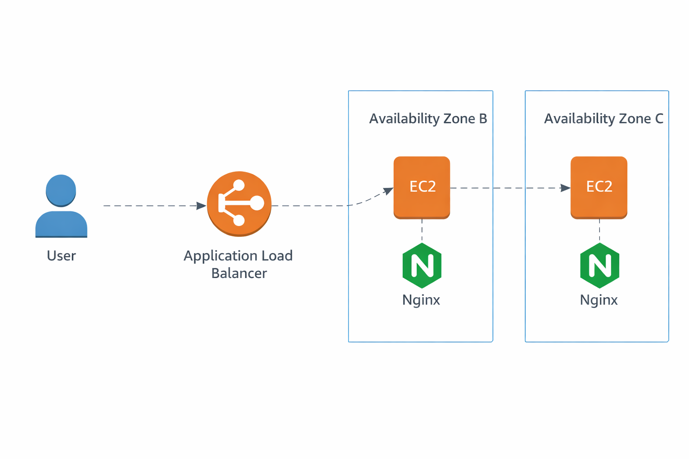

# aws-highly-available-static-website

## Architecture Diagram

# AWS Highly Available Static Website

## Project Overview
Designed and deployed a highly available static website on AWS using EC2 instances behind an Application Load Balancer.

## Architecture
User → Application Load Balancer → EC2 Instances → Nginx

## AWS Services Used
- VPC
- Public Subnets
- Internet Gateway
- EC2 (Ubuntu)
- AMI
- Target Group
- Application Load Balancer
- Security Groups
- Nginx

## Implementation Steps

### Networking
- Created VPC with CIDR block
- Created two public subnets in different AZs
- Attached Internet Gateway
- Configured route tables
- ### Resource Flow

### Web Server Setup
- Launched Ubuntu EC2
- Installed Nginx
- Deployed custom HTML page
### EC2 Instances

### High Availability
- Created AMI
- Launched multiple EC2 instances
- ### AnMI Created

### Load Balancing
- Created Target Group
- Registered instances
- Configured ALB listener
  ### Load Balancer

## Outcome
Achieved fault tolerance and traffic distribution across multiple EC2 instances.

### Web Server 1

## Skills Demonstrated
- AWS Networking
- Linux Administration
- Load Balancing
- High Availability Architecture
- Troubleshooting
